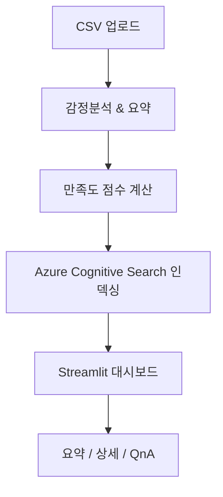

# 📊 교육 설문조사 AI 분석기

## 📌 프로젝트 소개
이 프로젝트는 **교육 설문조사 데이터를 AI로 자동 분석**하고,  
**시각화 및 질의응답(QnA)** 기능을 제공하는 시스템입니다.  

**주요기능**
- 설문조사 CSV 파일 업로드 → 자동 분석
- 감정분석(긍정/부정/중립)
- 만족도 점수 산출
- 긍정/부정 요약 생성
- 시각화 그래프 제공
- 자유로운 질문에 대한 AI 기반 답변(RAG)

---

## 🎯 문제 정의
- 텍스트 응답은 사람이 직접 읽고 요약하려면 **시간과 비용이 많이 소요** 된다.  
  
---

## 💡 해결 방법
- **Azure Text Analytics** → 감정분석 (긍정/부정/중립)  
- **Azure OpenAI** → 요약 및 QnA 생성  
- **Azure Cognitive Search** → 관련 응답 검색 (RAG)  
- **Streamlit + Plotly** → 대시보드 시각화  

---

## 🏗️ 시스템 아키텍처

---
## 🖼️ 주요 화면 예시
**1. 요약 탭**
- 항목별 긍정/부정 요약
- 만족도 점수 및 그래프 시각화
  
  


**2. 상세 탭**
- 항목별 긍정/부정 응답 원문 확인
  

**3. QnA 탭**
- 사용자가 질문 입력 → 관련 응답 검색 → AI 답변 생성
- 답변과 함께 근거 응답 제시


---

## 🛠️ 기술 스택
- **Frontend/UI**: Streamlit
- **Data Handling** : Pandas
- **Visualization**: Plotly
- **AI 분석**: Azure Text Analytics, Azure OpenAI
- **검색 인덱스**: Azure Search
  
--

## ⚙️ 설치 및 실행 방법
 **1. 저장소 클론** 
 ``` C
git clone https://github.com/parkminji03/MS_MVP.git
```
**2.필수 라이브러리 설치**
``` C
# 패키지 설치
pip install -r requirements.txt

#추가 패키지 설치
pip install streamlit transformers torch plotly dotenv azure-ai-textanalytics
```
**3. .env 파일 설정**
``` C
AZURE_OPEN_AI_KEY=<openai apikey>
AZURE_OPEN_AI_URL=<OPENAI endpoint>

AZURE_SEARCH_ENDPOINT=<ai search endpoint>
AZURE_SEARCH_API_KEY=<ai api key>
AZURE_SEARCH_INDEX=survey-responses

AZURE_TEXT_ANALYTICS_ENDPOINT=<language service endpoint>
AZURE_TEXT_ANALYTICS_KEY=<language service key>
```
**4. 실행**
```C
streamlit run app.py
```
**WebAPP 접속**
- url : https://ktdspmjwebapp.azurewebsites.net/
---

## 📈 기대 효과
- 설문 데이터 분석 시간 대폭 단축
- 실시간 질의응답으로 활용성 극대화
- 교육 품질 개선 및 피드백 반영 속도 향상
- 교육 뿐만 아니라 상품 피드백, 
---
## 📌 향후 개선 방향
**만족도 점수 계산 방식 개선**
- AS-IS : 전체 답변 중 긍정 답변의 개수로만 만족도 수치화
- TO-BE : 긍정, 부정, 중립, 오류 라벨로 분리되어 있으니 라벨 간소화 or 긍정 + 중립 비율 계산으로 만족도 수치화 개선

**감정 분석 개선**
- 다중 클래스 감정 분류 (예: 매우 긍정, 보통, 매우 부정 등)
- 도메인 특화 파인튜닝 모델 적용
